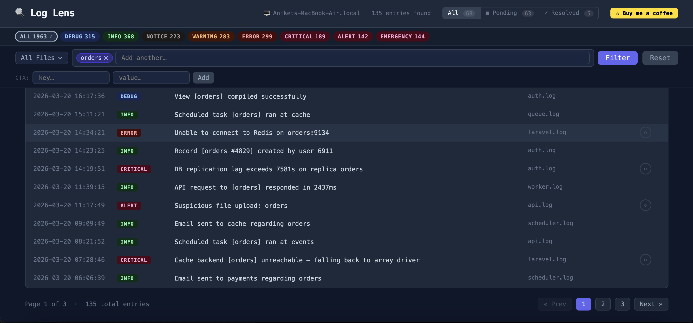

# 🔍 Laravel Log Lens

**A beautiful, dark-mode log viewer and analyzer for Laravel.**

Browse, search, filter, and resolve your application's log entries — all from a clean dashboard at `/log-lens`.

[](https://packagist.org/packages/aniket-magadum/laravel-log-lens)
[](https://www.php.net)
[](https://laravel.com)
[](LICENSE)
[](https://packagist.org/packages/aniket-magadum/laravel-log-lens)

---

## Screenshot



---

## Features

- **Dark UI dashboard** served at `/log-lens` (configurable prefix)
- **All 8 log levels** with colour-coded badges — `debug`, `info`, `notice`, `warning`, `error`, `critical`, `alert`, `emergency`
- **Multi-file log browsing** with a file selector dropdown
- **Full-text search** with multi-chip filtering
- **Context (CTX) filtering** — filter by key-value pairs from log context
- **Vendor vs. app stack trace highlighting** in exception entries
- **Resolve system** — mark individual log entries as resolved (persisted to disk)
- **Bulk resolve** — "Resolve all similar" resolves every entry sharing the same message in one click
- **Resolve filter toggle** — switch between All / Pending / Resolved with live entry counts
- **Shareable log links** — `?log=<hash>` auto-navigates to the exact entry, highlights it, and expands its details
- **Pagination** — configurable entries per page (default: 50)
- **Hostname display** in the header — always know which server you're viewing
- **Zero JS build step** — no Node.js or Vite required for the package itself

---

## Requirements

| Dependency | Version |
|------------|---------|
| PHP        | `^8.3`  |
| Laravel    | `^13.0` |

---

## Installation

Install the package via Composer:

```bash
composer require aniket-magadum/laravel-log-lens
```

The package is **auto-discovered** by Laravel — no need to register the service provider manually.

### Publish the config (optional)

```bash
php artisan vendor:publish --tag=log-lens-config
```

This publishes `config/log-lens.php` to your application's config directory.

---

## Configuration

After publishing, `config/log-lens.php` exposes the following options:

```php
return [
    // Enable or disable the Log Lens dashboard entirely
    'enabled' => env('LOG_LENS_ENABLED', true),

    // URL prefix — dashboard accessible at /{route_prefix}
    'route_prefix' => env('LOG_LENS_PREFIX', 'log-lens'),

    // Middleware applied to all Log Lens routes
    // Recommended: add 'auth' to protect the dashboard in production
    'middleware' => ['web'],

    // Directory where your .log files are kept
    'storage_path' => storage_path('logs'),

    // Number of log entries displayed per page
    'per_page' => 50,
];
```

### Available environment variables

| Variable             | Default     | Description                               |
|----------------------|-------------|-------------------------------------------|
| `LOG_LENS_ENABLED`   | `true`      | Set to `false` to disable the dashboard  |
| `LOG_LENS_PREFIX`    | `log-lens`  | URL prefix for the dashboard route        |

---

## Protecting the Dashboard

By default, Log Lens only applies the `web` middleware. **It is strongly recommended to add the `auth` middleware in production** to prevent unauthorised access to your logs.

Update `config/log-lens.php`:

```php
'middleware' => ['web', 'auth'],
```

Or restrict to specific roles / gates using a custom middleware of your own.

---

## Usage

### Accessing the dashboard

Visit `http://your-app.test/log-lens` in your browser.

### Searching logs

Type any keyword into the search bar. Each term becomes a removable chip — combine multiple chips for AND-style filtering.

### Filtering by log level

Click any level badge (ALL, DEBUG, INFO, WARNING, ERROR, etc.) in the badge strip to filter to that level only.

### Filtering by context values

Use the **CTX filter** to filter entries by context key-value pairs attached to your log calls.

### Resolving entries

Click the **Resolve** button on any row to mark it as resolved. Resolved entries are visually dimmed with a green checkmark. Resolved state is stored in `storage/app/log-lens-resolved.json`.

### Bulk resolve

Click **Resolve all similar** on any entry to resolve every log entry sharing the same message text in one action.

### Resolve filter toggle

Use the **All / Pending / Resolved** toggle in the header to show only unresolved (Pending) or only resolved entries. Live counts are shown inline.

### Sharing a log entry

Click the **Share** button on any row to copy a direct link to that entry. The link (`?log=<hash>`) will open the dashboard, navigate to the correct page, highlight the row, and auto-expand its detail panel.

---

## Support

If Log Lens saves you time and headaches, consider supporting its development:

[](https://buymeacoffee.com/aniketmagadum)

---

## License

Log Lens is open-sourced software licensed under the **[MIT license](LICENSE)**.
